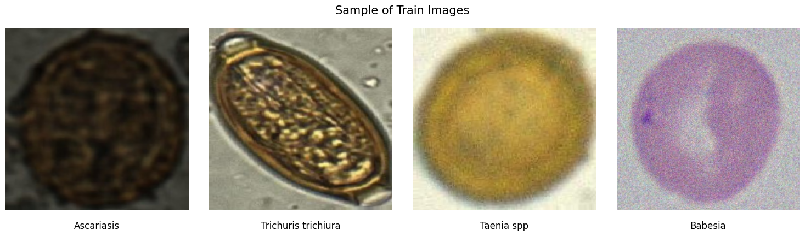

# Outline

- [1 - Context](#1)
- [2 - Image Data Preprocessing with Keras](#2)
- [3 - Transfer Learning with ResNet101V2 in Keras](#3)
- [4 - Training Configuration and Callbacks in Keras](#4)
- [5 - Conclusion](#5)

## 1 - Context

**Microscopic Parasite Detection**

In the field of medical parasitology. Our meticulously curated dataset contains microscopic images, expertly annotated into 15 distinct parasite classes. Our objectives include developing **Deep Learning** model to aid medical professionals, enhance diagnostics, and optimize healthcare resources. This project's significance lies in early intervention, resource allocation, and global health impact.

## Data Description :

Microscopic Image Classification Dataset for `Parasite Detection`. This dataset is a valuable resource for the field of medical parasitology and data science. It consists of a diverse collection of labeled microscopic images, each belonging to one of the 15 distinct classes representing various parasitic organisms. In this data description, we provide an overview of the classes, their meanings, and insights into the dataset structure.

1. **Ascariasis** (class_0): Images in this class depict the parasitic infection caused by Ascaris lumbricoides, a type of roundworm.

2. **Babesia** (class_1): This class represents the Babesia genus, which includes parasites that infect red blood cells and can lead to a disease known as babesiosis.

3. **Capillaria p** (class_2): Images here correspond to Capillaria philippinensis, a parasitic nematode known to infect the intestines.

4. **Enterobius v** (class_3): Class_3 includes images related to Enterobius vermicularis, commonly referred to as the pinworm, which infests the human gastrointestinal tract.

5. **Epidermophyton floccosum** (class_4): Images in this class pertain to the dermatophyte fungus Epidermophyton floccosum, responsible for causing skin infections.

6. **Fasciolopsis buski** (class_5): Class_5 represents the parasitic trematode Fasciolopsis buski, which infects the human intestines.

7. **Hookworm egg** (class_6): This class contains images of hookworm eggs, representing infections caused by various species of hookworms.

8. **Hymenolepis diminuta** (class_7): Images in this class depict the tapeworm Hymenolepis diminuta, a parasite found in the small intestines of rodents.

9. **Hymenolepis nana** (class_8): Class_8 represents Hymenolepis nana, a tapeworm that infects humans and rodents.

10. **Leishmania** (class_9): Images in this class are related to Leishmania parasites, which cause a group of diseases called leishmaniasis.

11. **Opisthorchis viverrine** (class_10): This class includes images of Opisthorchis viverrini, a liver fluke that infects humans through the consumption of raw or undercooked fish.

12. **Paragonimus spp** (class_11): Class_11 represents the Paragonimus genus, which includes lung flukes causing paragonimiasis, a lung infection.

13. **T. rubrum** (class_12): Images in this class pertain to Trichophyton rubrum, a fungus responsible for various dermatophytosis infections.

14. **Taenia spp** (class_13): Class_13 includes images related to the Taenia genus, encompassing tapeworms that infect humans and animals.

15. **Trichuris trichiura** (class_14): This class contains images of Trichuris trichiura, a whipworm that infects the human large intestine.

 
 

- here is training data sample:

---

## 2 - Image Data Preprocessing with Keras

This Part demonstrates how to preprocess image data using Keras's `ImageDataGenerator` for training a deep learning model. The data preprocessing steps applied are:

1. **Rescaling**: The pixel values of the images are rescaled to the range [0, 1] by dividing by 255.

2. **Data Augmentation**:

   - _Rotation_: Random rotation of the image by a maximum of 20 degrees.
   - _Horizontal Flip_: Randomly flips the image horizontally.
   - _Vertical Flip_: Randomly flips the image vertically.
   - _Fill Mode_: Strategy for filling in newly created pixels that may arise during rotation or shifts. 'Nearest' mode is used here which fills the missing pixels by the nearest existing pixel value.

3. **Flow from Directory**: The preprocessed data is generated in batches directly from the directories containing the training and validation images using `flow_from_directory` method of `ImageDataGenerator`.
   - For the training data, images are fetched from the directory 'train-data'.
   - For the validation data, images are fetched from the directory 'validation-data'.

Both training and validation data are resized to the target size specified by `target_size`, and the batch size is set to 32. The class mode is set to 'categorical' indicating that the labels are one-hot encoded.

 
 

---

## 3 - Transfer Learning with ResNet101V2 in Keras

This Part demonstrates how to utilize transfer learning with ResNet101V2 pre-trained on the ImageNet dataset in Keras.

1. **Base Model Initialization**:

   - The ResNet101V2 model is initialized with the following parameters:
     - `input_shape`: The shape of input images is set to (224, 224, 3).
     - `include_top`: Excludes the fully-connected layers at the top of the network, as we intend to add our own classifier.
     - `weights`: Pre-trained weights are loaded from the 'imagenet' dataset.

2. **Fine-tuning**:

   - The `base_model` is set to trainable, allowing the pre-trained weights to be fine-tuned during training.

3. **Model Architecture**:
   - A Sequential model is constructed with layers stacked sequentially:
     - `base_model`: The pre-trained ResNet101V2 model is added as the base.
     - `GlobalAveragePooling2D()`: Global average pooling layer is added to reduce the spatial dimensions of the feature maps.
     - `Dropout(0.3)`: Dropout layer is added to prevent overfitting.
     - `Dense(1024, activation='relu')`: Fully connected layer with 1024 units and ReLU activation.
     - `Dropout(0.3)`: Dropout layer is added again.
     - `Dense(15, activation='softmax')`: Output layer with 15 units (assuming 15 classes) and softmax activation for multi-class classification.

This architecture leverages the powerful feature extraction capabilities of the pre-trained ResNet101V2 model while allowing for customization of the classifier to suit the specific task at hand.

 
 

---

## 4 - Training Configuration and Callbacks in Keras

This Part illustrates the configuration of training settings and various callbacks used during model training in Keras.

1. **Learning Rate Schedule**:

   - The `lr_schedule` function defines a custom learning rate schedule based on the epoch number.
   - It starts with an initial learning rate (`initial_lr`) of 4.5e-5 and decreases it by a factor of 1.5 every 8 epochs.

2. **Callbacks**:

   - `LearningRateScheduler`: Adjusts the learning rate dynamically during training based on the custom schedule defined by `lr_schedule`.
   - `ModelCheckpoint`: Saves the best model to the file 'best_model.h5' based on validation performance.
   - `EarlyStopping`: Stops training if validation loss does not improve for 12 consecutive epochs, restoring the weights of the best performing model.

3. **Class Weights**:

   - Class weights are computed using the `compute_class_weight` function to handle class imbalance in the training data.
   - The computed class weights are then passed to the `fit` method using the `class_weight` parameter.

4. **Training**:
   - The `model.fit` method is called to train the model using the specified settings:
     - `epochs`: Number of training epochs set to 100.
     - `train_generator`: Training data generator.
     - `validation_data`: Validation data generator.
     - `callbacks`: List of callbacks to be applied during training, including the custom learning rate scheduler, model checkpointing, and early stopping.
     - `class_weight`: Dictionary of class weights to address class imbalance.

These configurations and callbacks enhance the training process by dynamically adjusting learning rates, saving the best model, early stopping to prevent overfitting, and handling class imbalance.

---

 
 
 

## 5 - Conclusion

This README provides an overview of the codebase for training neural network models using Keras, encompassing data preprocessing, model configuration, training, and evaluation. Key highlights include:

- **Data Preprocessing**: Leveraging the `ImageDataGenerator` class for image data preprocessing, incorporating techniques such as rescaling, rotation, and flips to enhance data diversity and model robustness.

- **Model Architecture**: Demonstrating transfer learning with pre-trained models such as `ResNet101V2`, facilitating feature extraction, followed by custom classifier layers tailored to specific tasks.

- **Training Configuration**: Configuring training settings with dynamic learning rate scheduling, utilizing callbacks for model checkpointing, early stopping, and addressing class imbalance via class weights.

- **Model Evaluation**: Assessing model performance through visualization of metrics such as loss, accuracy, and F1 score over epochs, providing insights into model convergence and generalization.

Furthermore, in a recent competition, our model achieved a notable performance:

- **Competition Performance**:
  - **Score**: Achieved a public score of 0.00847 and a private score of `0.00698`.
  - **Position**: Secured the `2nd` place in the competition.🎉🎉🎉🎉

 
 
 

## Final Word with Thanks

Thank you for taking the time to explore our project's README! We hope this guide has provided you with valuable insights and resources for training neural network models using Keras.

We extend our sincere gratitude to all contributors, supporters, and users who have contributed to the success of this project. Your feedback, suggestions, and contributions are highly appreciated and essential for the continuous improvement of our framework.

If you have any questions, feedback, or need assistance, please feel free to reach out to the project maintainers. We're here to help and support you on your journey with neural networks and machine learning.

---
