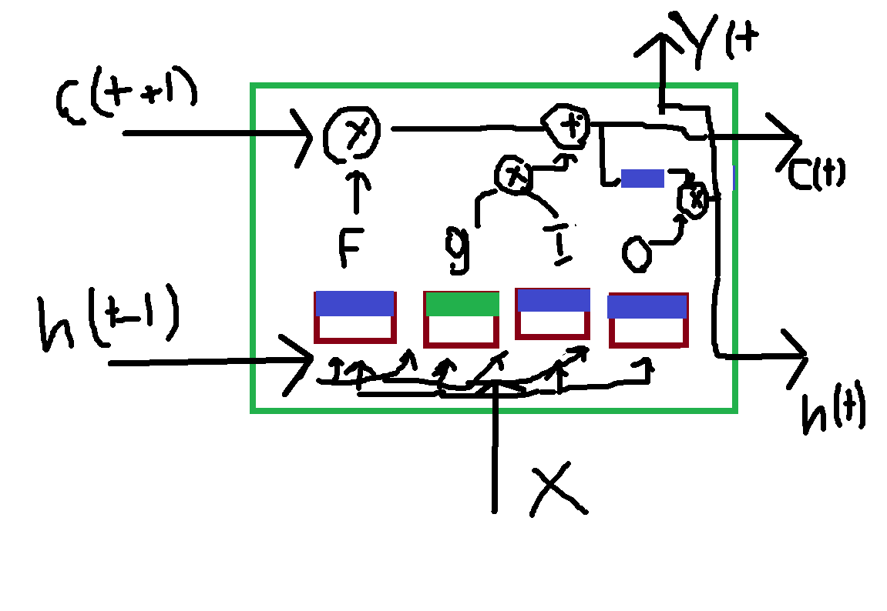

# CH15 Exercises: Processing Sequences Using RNNs and CNNs

### Part 1: Theory Exercises [1–8]

1. Can you think of a few applications for a sequence-to-sequence RNN? What about a sequence-to-vector RNN and a vector-to-sequence RNN?

    - **Sequence-to-sequence**: Examples include machine translation, summarization, question-answering, text-to-speech, video captioning, or weather prediction.  
    - **Sequence-to-vector**: Examples include sentiment analysis, text classification, and classifying music by genre.  
    - **Vector-to-sequence**: Examples include image captioning (input an image as a vector and produce caption text as a sequence) and video generation from an image.  

2. How many dimensions must the inputs of an RNN layer have? What does each dimension represent? What about its outputs?

    - **Input dimensions**: A 3D tensor [batch size, sequence length (time steps), features].  
      For example, if we have a batch containing 5 time series, each with 10 time steps and 2 input features per time step (e.g., temperature and wind speed), the input for the RNN layer would be [5, 10, 2].  
    - **Output dimensions**: A 3D tensor [batch size, sequence length, number of neurons].

3. If you want to build a deep sequence-to-sequence RNN, which RNN layers should have `return_sequences=True`? What about a sequence-to-vector RNN?

    - **Sequence-to-sequence RNN**: All layers must have `return_sequences=True`.  
    - **Sequence-to-vector RNN**: All layers except the last one should have `return_sequences=True`, as the final layer returns only the last output.

4. Suppose you have a daily univariate time series, and you want to forecast the next seven days. Which RNN architecture should you use?

    - A simple architecture could involve stacking RNN layers with `return_sequences=True` (except for the last one). The final RNN layer should have 7 neurons without returning sequences. This model can be trained using sliding windows of the data.

5. What are the main difficulties when training RNNs? How can you handle them?

    - **Handling long sequences**: This can be challenging, but it can be addressed using improved units like LSTMs or GRUs or by employing Conv1D for feature extraction.  
    - **Non-stability of gradients and outputs**: To address this, avoid using ReLU activation, instead use sigmoid or tanh activations. Additionally, apply techniques like layer normalization, a smaller learning rate, dropout, and gradient clipping.

6. Can you sketch the LSTM cell’s architecture?

    - The LSTM cell includes a short-term state vector and a long-term state vector. At each time step, the inputs and the previous short-term state are passed to four gates:  
        - **Main gate (g)**  
        - **Forget gate (f)**  
        - **Input gate (I)**  
        - **Output gate (O)**  

      - The forget gate determines what to remove from the long-term state vector. The input gate decides which output from the main gate should be added. The output gate determines the short-term state and final output.  
      
</img>

7. Why would you want to use 1D convolutional layers in an RNN?

    - 1D convolutional layers can preprocess inputs efficiently, for instance, by reducing their temporal resolution (downsampling). This can help the RNN layers detect long-term patterns. In some cases, convolutional layers alone can be used, such as in a WaveNet architecture.

8. Which neural network architecture could you use to classify videos?

    - A good approach involves using a pretrained model (e.g., ResNet) as a backbone to perform feature extraction and provide a high-level representation of each video frame. These representations can be stacked in a time-series manner, batched, and then fed into a sequence-to-vector model, such as a Conv1D-GRU-Dense stack with dimensions [batch size, sequence length, representation length].
