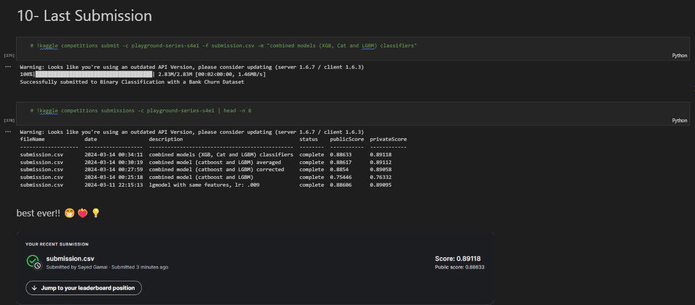

# Project Outline
- **[1- Problem Statement](#1)**
    - [1.1 The Challenge](#1.1)
    - [1.2 About Dataset](#1.2)
- **[2- Loading Packages](#2)**

### EDA
- **[3- Univariate Analysis](#3)**
- **[4- Bivariate Analysis](#4)**
- **[5- Conclusion](#5)**

### Machine Learning
- **[6- Data Preprocessing](#6)**
- **[7- BEAST Model 💡](#7)**
- **[8- Error Analysis](#8)**
- **[9- Voting](#9)**
- **[10- Last Submission](#10)**

 
 
 

# 1- Problem Statement

### 1.1 The Challenge

For this Competition, The task is to predict whether a customer continues with their account or closes it (e.g., churns)!

### 1.2 About Dataset

The bank customer churn dataset is a commonly used dataset for predicting customer churn in the banking industry. It contains information on bank customers who either left the bank or continue to be a customer. The dataset includes the following attributes:

- Customer ID: A unique identifier for each customer
- Surname: The customer's surname or last name
- Credit Score: A numerical value representing the customer's credit score
- Geography: The country where the customer resides (France, Spain or Germany)
- Gender: The customer's gender (Male or Female)
- Age: The customer's age.
- Tenure: The number of years the customer has been with the bank
- Balance: The customer's account balance
- NumOfProducts: The number of bank products the customer uses (e.g., savings account, credit card)
- HasCrCard: Whether the customer has a credit card (1 = yes, 0 = no)
- IsActiveMember: Whether the customer is an active member (1 = yes, 0 = no)
- EstimatedSalary: The estimated salary of the customer
- Exited: Whether the customer has churned (1 = yes, 0 = no)
    

    

 
 
 

---

 
 
 

 
 
 

# 5- Analysis Conclusion

 
Based on the analysis of the bank customer churn dataset, we have gathered valuable insights to understand and predict customer churn.
 
 
Firstly, we identified the problem statement, which revolves around predicting whether a customer will continue with their account or churn. The dataset includes various attributes such as customer ID, credit score, geography, gender, age, tenure, balance, number of products, credit card status, activity status, estimated salary, and churn status.
 
 
Upon initial exploration, we observed that only 21% of the customers in the dataset have churned. However, the customer ID is not unique, making it unsuitable as a row identifier. To handle the surname column, which contains many unique names, we proposed utilizing target encoding. Additionally, most customers are from France, suggesting the use of one-hot encoding for the geography feature.
 
 
Further analysis revealed that the dataset predominantly consists of male customers, and the age column does not contain extreme values, with a minimum age of 18, which is realistic for banking data. We also identified the presence of zero balances, likely due to customers using the bank for non-saving operations. Additionally, there is a high percentage of non-active members, which could be predictive of churn.
 
 
Geographically, Germany has the highest churn rate, while females exhibit a higher churn rate despite their lower presence in the dataset compared to males. The number of products used by a customer also influences churn, with higher churn rates observed for customers with three or four products.
 
 
Correlation analysis revealed weak linear correlations between churn and certain features such as age, surname exited rate, active membership, number of products, and balance. The distribution of ages among churned customers appears normal, indicating no specific age group with a higher propensity to churn.
 
 
Visualizations indicated that customers who churn tend to have no credit card and are non-active members. Furthermore, the impact of active membership on churn is significant, while holding a credit card has a minor effect.
 
 
We proposed the creation of new features such as the age-tenure ratio, surname exited rate, and active credit card status, which could enhance predictive performance. To address multicollinearity issues, we suggested removing certain features like active membership, credit card status, and tenure, although retaining them may not significantly impact machine learning algorithms' robustness.
 
 
In conclusion, leveraging the insights gained from exploratory analysis and feature engineering, we are equipped to build predictive models to identify potential churners and implement targeted retention strategies to mitigate customer attrition.

 
 
 
 

--- 

 

 Thank you for reaching this point. I hope you enjoyed the journey. 😁🎉❤️

 Note that machine learning process is iterative cyclic in nature, so all results (features, setting hyperparameter) come after alot of *Tuning* process

    

