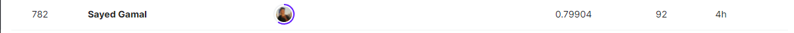

# Outline

- **[1- Project Outline](#1)**
- **[2- Problem Statement](#2)**

  - [1.1 The Challenge](#2.1)
  - [1.2 Data Content](#2.2)

- **[3- Conclusion](#3)**
- **[4- Evaluation](#4)**

---

### 1- Project Outline

- 1- Loading Packages

- 3- Univariate Analysis
- 4- Bivariate Analysis
- 5- Conclusion

- 6- Data Preprocessing
  - 6.1 Quick Pipeline
  - 6.2 Full Pipeline
- 7- BEAST Model
- 8- Error Analysis
- 9- Voting Classification
- 10- Final Submission

---

 
 
 

## 2- Problem Statement

### 2.1 The Challenge

    
- The sinking of the Titanic is one of the most infamous shipwrecks in history.

- On April 15, 1912, during her maiden voyage, the widely considered “unsinkable” RMS Titanic sank after colliding with an iceberg. Unfortunately, there weren’t enough lifeboats for everyone onboard, resulting in the death of 1502 out of 2224 passengers and crew.

- While there was some element of luck involved in surviving, it seems some groups of people were more likely to survive than others.

- In this challenge, the task is to build a predictive model that answers the question: “what sorts of people were more likely to survive?” using passenger data (ie name, age, gender, socio-economic class, etc).

 
 

  

 
 
 

### 2.2 Data Content

#### Overview

The Titanic dataset is a classic dataset in the field of data science and machine learning. It contains information about passengers aboard the ill-fated Titanic, including details such as their demographics, ticket information, and survival status.

#### Data Card

#### Variables

1. **PassengerId:** Unique identifier for each passenger.
2. **Survived:** Binary variable indicating whether the passenger survived (1) or not (0).
3. **Pclass:** Ticket class (1st, 2nd, or 3rd class).
4. **Name:** Passenger's name.
5. **Sex:** Gender of the passenger.
6. **Age:** Age of the passenger.
7. **SibSp:** Number of siblings/spouses aboard.
8. **Parch:** Number of parents/children aboard.
9. **Ticket:** Ticket number.
10. **Fare:** Passenger fare.
11. **Cabin:** Cabin number.
12. **Embarked:** Port of embarkation (C = Cherbourg, Q = Queenstown, S = Southampton).

### Target Variable

- **Survived:** This is the target variable we aim to predict. It indicates whether a passenger survived the sinking of the Titanic.

## 3- Conclusion

Exploring the Titanic dataset reveals **fascinating details** about passengers and their survival. Surprisingly, more than **60%** of passengers did not survive, mostly being men. The main starting point was **Southampton**, and over **50%** of passengers were in the `3rd class`, showing a clear class difference. The age distribution looked like a typical curve, with more younger passengers, possibly influencing who survived.

When we looked at cabins, some, like **Cabins E, D, and B**, had higher survival rates. We found connections between passenger and fare class, suggesting that where people stayed on the ship related to their ticket prices. Understanding different passenger classes showed clear differences in survival rates, with 1st and 2nd classes having higher rates. Examining factors like gender, family size, embarkation port, and titles gave us a more detailed picture. Interestingly, those with titles like '`Dr/Military/Noble/Clergy`' surprisingly had lower survival rates, prompting more questions.

Taking a closer look at passengers with high fares, we discovered a group that was mostly female, 1st class, and from **Cherbourg**, with notably higher survival rates. This made us wonder about preferential treatment during evacuation based on socio-economic factors. Overall, the Titanic dataset goes beyond numbers, providing a story of social dynamics, spatial influences, and unexpected connections, giving us insights into the tragic events that unfolded.

 
 
 

## 4- Evaluation

Ridge classifier reached `79.1%` on submission result, when Voting Ridge with Logistic regression, LinearSVC and Calibrated classifier reached `79.9%` putting us among `top5%`.

